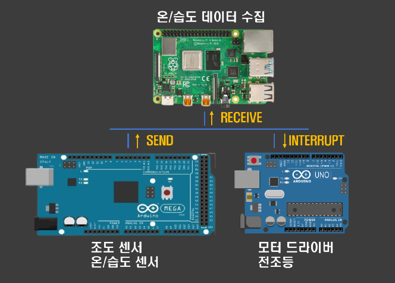
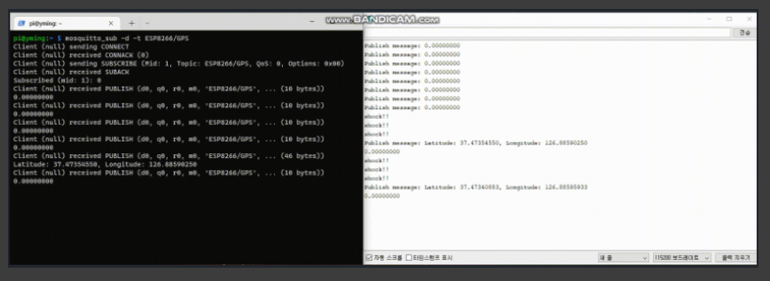

# MAIN PROJECT - CRC
## Communications Remote controlled Car

Project using socket &amp; bluetooth &amp; CAN with RPi4,Arduino UNO, Mega, ESP32

## 1. 프로젝트 개요

> 커넥티드카 기반 차량 데이터 모니터링, ECU 제어 및 연계 제어 시스템 구축

* 사물 인터넷 장치를 활용한 자동차 네트워크 형성
* 차량 내 전자 장치(EUC) 통신을 넘어선 개방형 모빌리티
* CAN(Controlled Area Network) 통신 프로토콜을 활용한 ECU간 데이터 교환
* 제어 시스템 간 연계 시스템 구축

## 2. 시스템 구조

## 3. THREE MINI PROJECTS

* Windows socket 기반 채팅 프로그램 - [GITHUB LINK](https://github.com/njs702/project_oneclick)
* 차량 주변 기기 통신 프로젝트 - [GITHUB LINK](https://github.com/njs702/project_SCE)
* CAN BUS 데이터 모니터링 프로젝트 - [GITHUB LINK](https://github.com/njs702/CAN_BUS)

### 3.1 Windows socket 기반 채팅 프로그램

그림1 - 서버와 클라이언트

* TCP/IP 기반 SOCKET 통신
* Multithread for multiple clients
* Singlethread for multiple clients - multiplexing

### 3.2 차량 주변 기기 통신 프로젝트

그림2 - 사고 감지 및 알림 시스템

그림3 - 졸음운전 방지 시스템

* TCP/IP 기반 MQTT 통신
* Google assistant + OPEN API (Python)
* MQTT 통신 기반 사고 알림 시스템
* 졸음운전 방지 시스템

### 3.3 CAN BUS 데이터 모니터링 프로젝트

그림4 - CAN BUS 데이터 모니터링

그림5 - CAN_3BUS 결과

* CAN communication
* 제어 시스템 간 연계 시스템 구축
* 다른 종류의 단말 간 통신(RPI, ARDUINO UNO)
* 3대 이상의 multiple devices

## 4. MAIN PROJECT

> CRC - Communications Remote Controlled Car

* CAN 통신을 활용한 제어 시스템 간 데이터 교환 & 제어 연계 시스템 구축
* TCP/IP 기반 SOCKET 통신을 활용한 데이터 수집 & 시각화
* TCP/IP 기반 MQTT 통신을 활용한 사고 알림 시스템
* Bluetooth 통신 기반 원격 제어(with ESP32 & Wii remote)

### 4.1 CAN 통신을 활용한 제어 시스템 간 데이터 교환 & 제어 연계 시스템 구축
**GOALS**

1. 서로 다른 장치 간 연계 시스템 구축하기
2. CAN 통신 프로토콜을 활용해 데이터 교환 & 자동 처리
3. 서로 다른 종류의 단말 간 데이터 교환(Arduino, RPI)

그림6 - 구조도

그림7 - 조도 센서 with CAN 동작 화면

**구현 원리**

* 3대의 디바이스 - 조도 센서 및 온/습도 센서 데이터 측정 단말(MEGA), LED 제어 단말(UNO), 온/습도 데이터 저장 단말(RPI)
* MEGA에서는 지속적으로 센서를 통해 데이터 수집
* 조도 센서 값이 특정 임계점을 넘는 순간 CAN BUS를 통해 데이터를 SEND
* UNO에서는 해당 trigger가 발생하면, interrupt를 발생시켜 LED를 켜게 된다.
* RPI는 CAN 통신 전용 스레드를 통해 MEGA로부터 각종 센서 데이터를 받고, 지속적으로 저장한다.

### 4.2 TCP/IP 기반 SOCKET 통신을 활용한 데이터 수집 & 시각화
**GOALS**

1. 서로 다른 장치 간 연계 시스템 구축하기
2. SOCKET 통신을 활용한 데이터 전송
3. 서로 다른 종류의 단말 간 데이터 교환(아두이노, RPi, Android)

그림8 - 구조도

그림9 - RPi 데이터 수집, Android 데이터 시각화

**구현 원리**

* 3대의 디바이스 - 센서 데이터 측정 단말(MEGA), 데이터 저장 및 전송 단말(RPi), 데이터 시각화 및 제어 단말(Android)
* MEGA에서는 지속적으로 센서를 통해 데이터 수집(온/습도, 조도, 자이로, 초음파 센서 값)
* CAN BUS를 통해 지속적으로 데이터를 전송한다
* RPi에서 CAN 통신 전용 스레드를 통해 센서 데이터를 받고, SOCKET을 통해 안드로이드로 데이터 값을 전달한다.

### 4.3 TCP/IP 기반 MQTT 통신을 활용한 사고 알림 시스템
**GOALS**

1. 서로 다른 장치 간 연계 시스템 구축하기
2. MQTT 통신을 활용한 데이터 전송
3. 서로 다른 종류의 단말 간 데이터 교환(ESP32, RPi)

그림10 - 구조도

그림11 - EPS32 trigger 발생 시 RPi로 신호 전달

**구현 원리**

* 2대의 디바이스 - GPS & 불꽃 감지 및 자이로 센서 측정 단말(ESP32), GPS 데이터 가공 및 활용 단말(RPi)
* ESP32에서는 지속적으로 충격 감지, 불꽃 감지, GPS 데이터를 수집한다
* 특정 trigger가 발생하면, MQTT 통신을 통해 현재 GPS 값을 RPi로 전달한다
* RPi에서는 받은 GPS 정보를 기반으로 역지오코딩을 통해 위도,경도를 위치 정보로 교환해 사고 위치를 알려준다.

### 4.4 Bluetooth 통신 기반 원격 제어(with ESP32 & Wii remote)
**GOALS**

1. 서로 다른 장치 간 연계 시스템 구축하기
2. Bluetooth 통신을 활용한 데이터 전송
3. 서로 다른 종류의 단말 간 데이터 교환(아두이노, ESP32)

그림12 - 구조도

그림13 - Wii remote joystick을 활용한 무선 원격 조종

**구현 원리**

* 2대의 디바이스 - Wii remote 컨트롤 단말(ESP32), 모터 드라이버 모듈 제어 단말(Arduino)
* ESP32에서는 Wii remote nunchuk의 조이스틱 데이터를 수집한다.
* 조이스틱의 방향에 따라 데이터를 분기해 bluetooth로 전달한다.
* 아두이노에서는 해당 데이터를 받고 받은 신호에 따라 모터 드라이버 모듈을 제어한다.

## 5. 기술스택 & 구현 환경

### 5.1 기술스택

* 디바이스 - Android, Arduino UNO, Arduino MEGA, RPi4, ESP32
* 협업 및 버전 관리 도구 - Jira, GIT, GITFLOW, GITHUB
* 통신 관련 - CAN, Bluetooth, Socket, MQTT
* 조이스틱 - Wii remote nunchuk

그림14 - 기술스택

### 5.2 구현환경

* 운영체제 - Linux(RPi), Windows(Arduino)
* 개발 툴 - Android studio
* 빌드 도구 - Gradle, Arduino IDE
* 개발 환경 - Arduino IDE + VSCODE, Visual studio 2022

그림15 - 구현환경

## 6. 구현 결과 & 결론

### 6.1 구현 결과

그림15 - 구현결과 1

그림15 - 구현결과 2

### 6.2 결론

**POST MORTEM - 프로젝트 회고**

* 잘된 일
1. 전체적인 프로젝트 설계 및 구현
2. 추가 모듈 적용 및 구현(MCP2515, Wii remote ...)
3. 아이디어 컨셉에 맞는 기능 구현

* 잘 못된 일
1. 개인 능력 미달로 인한 아이디어의 확장 제한
2. 일정 관리 미흡
3. 프로젝트 결과물 외적인 디자인

* 개선책 & 발전 방향
1. 추가적인 다양한 모듈을 사용해 제어 연계 시스템 추가
2. 수집된 데이터를 가공하여 사용할 수 있는 능력
3. 데이터 전송 속도 성능 개선